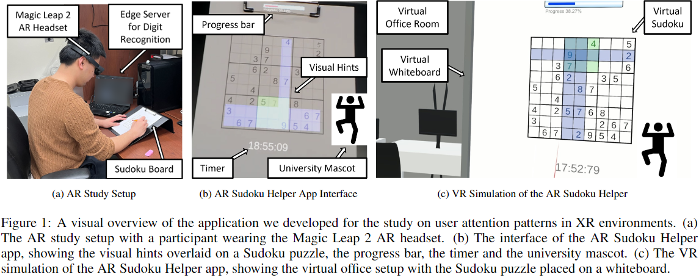

# Attention-Patterns-in-Extended-Reality
This is the code repo for ISMAR'24 Submission #6227. Code has been processed to be anonymous, in which we replace the university mascot with "mascot" and provided sample dataset with the same features but not revealing the raw data we collected. Our study setup is shown in Figure 1.

Please refer to [first order analysis](gaze_data_analysis/README.md) and [machine learning](mvts_transformer/README_Sudoku.md) for code descriptions. Sample data is provided in [dataset](dataset). Please be aware that anonymous github might hide files from viewers in the website, but one can type in the address bar `/dataset/AR_samples/p1/p1_final.csv` or  `/dataset/VR_samples/p1/p1_final.csv` to view those sample data files. [Sample link to AR data](/dataset/AR_samples/p1/p1_final.csv)