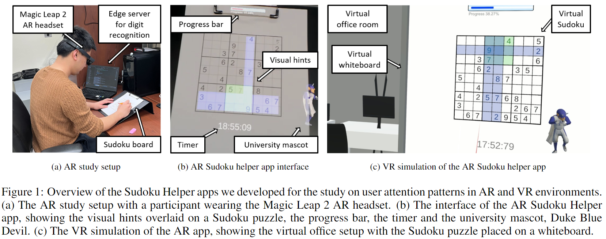

# Attention-Patterns-in-Extended-Reality
This is the code repo for ISMAR'24 Submission #6227. Code has been processed to be anonymous, in which we replace the university mascot with "mascot" and provided sample dataset with the same features but not revealing the raw data we collected. Our study setup is shown in Figure 1.

Please refer to [first order analysis](gaze_data_analysis/README.md) and [machine learning](mvts_transformer/README_Sudoku.md) for code descriptions. Sample data is provided in [dataset](dataset)
